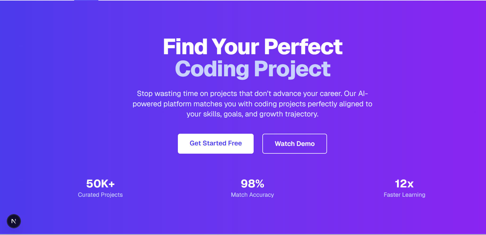

<p align="center">
	
</p>

# CodePath - Developer Project Recommendation Platform

A Next.js application that helps developers find the perfect coding projects to advance their careers through AI-powered recommendations.

## 🚀 Features

- **Personalized Matching**: AI analyzes GitHub profiles, skills, and career goals
- **Skill Progression Tracking**: See how each project advances your skills
- **Time-Smart Recommendations**: Projects matched to your available time
- **Career-Focused Curation**: Real-world relevance for employability
- **Community Learning**: Connect with other developers and mentors
- **Progress Analytics**: Detailed insights into learning velocity

## 🛠️ Tech Stack

- **Frontend**: Next.js 15 with Turbopack, React 19, TypeScript
- **Styling**: Tailwind CSS v4
- **Build Tool**: Next.js with App Router
- **Development**: Fast refresh with Turbopack
- **Utilities**: UUID for unique identifiers
- **Deployment**: Ready for Vercel/Netlify

## 📦 Installation

1. Clone the repository:

```bash
git clone https://github.com/kiganyamburu/project-task.git
cd project-task
```

2. Install dependencies:

```bash
npm install
```

3. Run the development server (with Turbopack for faster builds):

```bash
npm run dev
```

4. Open [http://localhost:3000](http://localhost:3000) in your browser.

## 🏗️ Project Structure

```
src/
├── app/
│   ├── globals.css
│   ├── layout.tsx
│   ├── page.tsx
│   ├── login/
│   │   └── page.tsx
│   ├── signup/
│   │   └── page.tsx
│   └── api/
│       ├── auth/
│       │   ├── login/
│       │   │   └── route.ts
│       │   └── signup/
│       │       └── route.ts
│       ├── projects/
│       │   └── recommendations/
│       │       └── route.ts
│       └── test/
│           └── route.ts
├── components/
│   ├── Navigation.tsx
│   ├── Hero.tsx
│   ├── Features.tsx
│   ├── HowItWorks.tsx
│   ├── RecommendationEngine.tsx
│   ├── TechStack.tsx
│   ├── Roadmap.tsx
│   ├── Branding.tsx
│   ├── CTA.tsx
│   └── Footer.tsx
├── lib/
│   └── database.ts
├── types/
│   └── api.ts
└── middleware.ts
```

## 🎨 Design System

- **Primary Colors**: Indigo gradient (600-400)
- **Typography**: Clean sans-serif with monospace for code
- **Layout**: Responsive design with Tailwind CSS
- **Tone**: Professional yet approachable for developers

## 📝 Development

- **Type Safety**: Full TypeScript support with strict types
- **Code Quality**: ESLint configuration included
- **Responsive**: Mobile-first design approach
- **Accessibility**: Semantic HTML and proper contrast ratios
- **API Routes**: Built-in authentication and recommendation endpoints
- **Database**: Database abstraction layer ready for integration
- **Fast Development**: Turbopack for lightning-fast hot reloads
- **Hydration Safety**: Built-in protection against browser extension conflicts

### Common Issues

**Hydration Mismatch Error**: If you encounter hydration warnings due to browser extensions (like Grammarly), the layout includes `suppressHydrationWarning` to handle these safely. For custom components that need client-side only rendering, use the `NoSSR` component or `useIsClient` hook provided in the project.

## 🚀 Deployment

The project is ready to deploy on:

- **Vercel**: `npm run build` and connect your repo
- **Netlify**: Deploy from GitHub with build command `npm run build`
- **Other platforms**: Use the static export from `.next` folder

## 📋 Scripts

- `npm run dev` - Start development server with Turbopack
- `npm run build` - Build for production
- `npm run start` - Start production server
- `npm run lint` - Run ESLint

## 🤝 Contributing

1. Fork the repository
2. Create a feature branch
3. Make your changes
4. Run `npm run build` to ensure it builds successfully
5. Submit a pull request

## 📄 License

This project is open source and available under the [MIT License](LICENSE).
